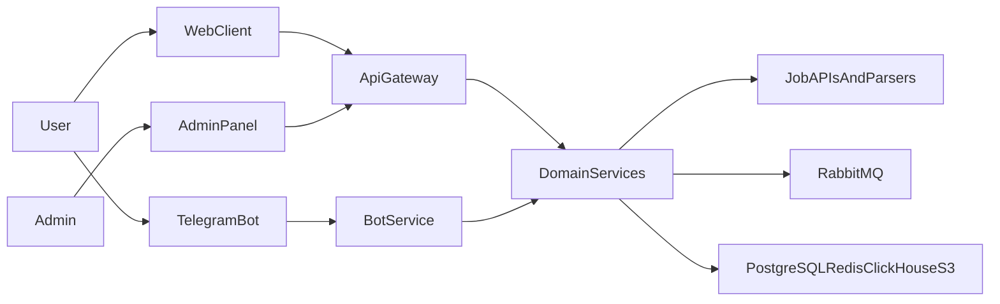

# Context Diagram

```mermaid
flowchart LR
    User[User] --> Web[WebClient]
    User --> Tg[TelegramBot]
    Admin[Admin] --> AdminUi[AdminPanel]
    Web --> Gateway[ApiGateway]
    Tg --> Bot[BotService]
    AdminUi --> Gateway
    Gateway --> Domain[DomainServices]
    Bot --> Domain
    Domain --> Integrations[JobAPIsAndParsers]
    Domain --> Messaging[RabbitMQ]
    Domain --> Storage[PostgreSQLRedisClickHouseS3]
```

## External systems

- job platform APIs
- HTML-based vacancy pages
- Telegram channels
- SMTP provider
- Telegram Bot API
